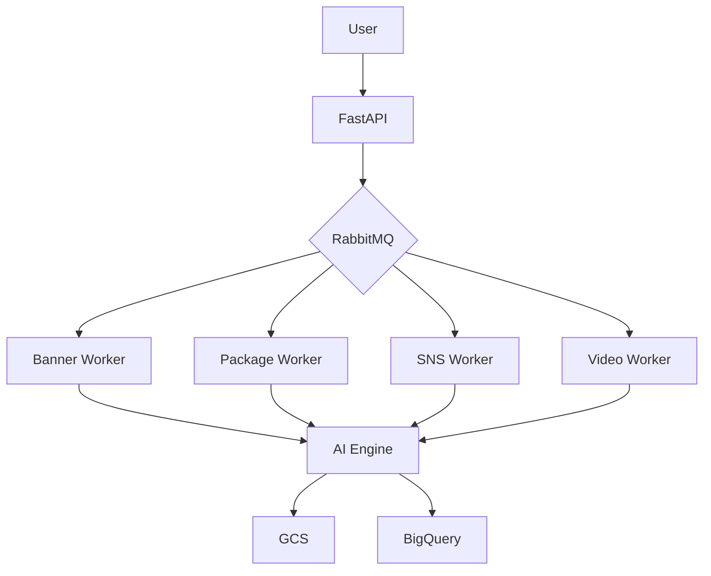
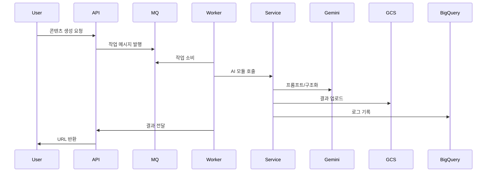

# 🚀 CHILLGRAM AI  
## Enterprise-Grade AI Content Automation Pipeline

> Generative AI + Cloud Native Architecture 기반  
> 텍스트 구조화부터 이미지·비디오 생성까지 End-to-End 자동화 시스템

---

# 1️⃣ 프로젝트 비전 (Vision)

CHILLGRAM AI는 기업의 콘텐츠 제작 공정을 자동화하기 위한 AI 기반 분산 처리 파이프라인입니다.

마케팅·광고·SNS 환경에서 요구되는 대량 시각 콘텐츠 제작을:

- ⚡ 더 빠르게
- 🎯 더 일관되게
- 📈 더 확장 가능하게

만드는 것을 목표로 설계되었습니다.

---

# 2️⃣ 해결하고자 한 문제 (Problem Statement)

| 기존 콘텐츠 제작 문제 | CHILLGRAM의 해결 방식 |
|------------------------|------------------------|
| 제작 시간 과다 | AI 기반 자동 생성 |
| 디자이너 의존도 높음 | 텍스트 → 자동 구조화 → 생성 |
| 스타일 일관성 부족 | 브랜드 가이드 기반 프롬프트 설계 |
| 대량 제작 불가능 | RabbitMQ 기반 병렬 워커 |
| 반복 작업 비효율 | 비동기 AI 파이프라인 |

---

# 3️⃣ 전체 시스템 아키텍처

## 🔷 설계 철학

- **비동기 처리 (Async First)**
- **서비스 디커플링 (Loose Coupling)**
- **모듈 기반 AI 서비스 구조**
- **Cloud Native Storage & Analytics**

---

## 🔷 아키텍처 다이어그램



---

# 4️⃣ 시스템 구성 요소 상세 설명

---

## 4.1 API Gateway

- FastAPI 기반
- 요청 검증 및 파일 업로드 처리
- 프로젝트별 디렉터리 생성 (`ai/<project_id>/`)
- 장시간 작업은 RabbitMQ로 발행
- GCS URL 반환

---

## 4.2 메시지 큐

### 🐇 RabbitMQ

- API ↔ Worker 완전 분리
- 장시간 작업 비동기 처리
- DLQ 지원
- 확장 시 Worker만 수평 확장

라이브러리:
- `aio-pika`
- `asyncio`

---

## 4.3 비동기 워커

- `rabbit_worker.py`
- Python 3.11 + asyncio
- Semaphore 기반 동시성 제어
- JobRunner 패턴 적용

처리 흐름:
1. 작업 수신
2. payload 정규화
3. 서비스 모듈 위임
4. GCS 업로드
5. 결과 큐 발행

---

## 4.4 서비스 모듈 (`services/`)

모든 콘텐츠 유형은 완전 독립 모듈화

### 🖼 배너 생성
- `banner_generate.py`
- `rembg` 배경 제거
- 비율 대응 로직
- Gemini 기반 텍스트 구성

### 📦 패키지 디자인
- `package_generate.py`
- Gemini Vision 기반 디자인 생성
- instruction 기반 수정 가능

### 📐 다이라인 분석
- `dieline_generate.py`
- OpenCV 기반 구조 분석
- 패널별 AI 디자인 배치

### 📱 SNS 이미지
- `sns_image_generate.py`
- 플랫폼 최적화 비율 대응
- 텍스트 자동 배치

### 🎬 비디오 생성
- `video_generate.py`
- `video_2.py`
- Gemini + Replicate 연동
- 이미지 → 동영상 변환

---

# 5️⃣ AI 파이프라인 상세 흐름

## ① Text Structuring
- 사용자 입력 텍스트 → Gemini 구조화
- 프롬프트 엔지니어링 자동화

## ② 이미지/비디오 생성
- 생성 or 편집
- AI 모델 호출
- 후처리 (OpenCV / Pillow)

## ③ 저장 및 분석
- 결과물 → GCS
- 로그/메타데이터 → BigQuery

---

# 6️⃣ 데이터 흐름 (Sequence)



---

# 7️⃣ 저장소 전략

## ☁ Google Cloud Storage
- 대용량 이미지/비디오 저장
- Public URL 반환

## 📊 BigQuery
- 작업 로그
- 성능 분석
- 실패 분석
- 비즈니스 인사이트

## ⚡ Redis
- 상태 캐싱
- 중복 요청 방지
- 실시간 상태 관리

---

# 8️⃣ 확장성 전략

- Worker 수평 확장
- 서비스별 큐 분리
- AI 모델 배치 최적화
- GPU 확장 가능
- Docker 컨테이너 기반 배포

---

# 9️⃣ 오류 처리 전략

- RabbitMQ DLQ
- 재시도 정책
- 멱등성 설계
- BigQuery 오류 로그 저장
- 예외 처리 모듈화

---

# 🔟 기술 스택

### Backend
- Python 3.11
- FastAPI
- asyncio
- aio-pika

### AI
- Gemini API
- Replicate
- rembg
- OpenCV
- Pillow

### Infra
- RabbitMQ
- Redis
- Google Cloud Storage
- Google BigQuery
- Docker

---

# 1️⃣1️⃣ 폴더 구조

```bash
CHILLGRAM_AI/
│
├── main.py
├── rabbit_worker.py
├── worker.py
├── Dockerfile
├── requirements.txt
│
├── services/
│   ├── banner_generate.py
│   ├── dieline_generate.py
│   ├── package_generate.py
│   ├── sns_image_generate.py
│   ├── video_generate.py
│   └── video_2.py
│
└── ai/
    └── <project_id>/
```

---

# 1️⃣2️⃣ 이 프로젝트의 강점 (What Makes It Strong)

- 단순 AI 사용이 아니라 엔터프라이즈 아키텍처 적용
- 비동기 기반 병렬 처리
- AI 모델 교체 가능 구조
- DLQ 포함한 운영 고려 설계
- 분석 시스템(BigQuery)까지 포함

---

# 1️⃣3️⃣ 향후 개선 계획

- 실시간 생성 상태 스트리밍
- A/B 테스트 자동화
- 프롬프트 성능 분석 시스템
- Serverless Worker 전환
- GPU 전용 워커 분리

---

# 🔥 결론

CHILLGRAM AI는 단순 이미지 생성기가 아니라,

**AI + Distributed System + Cloud Architecture가 결합된  
Production-ready 콘텐츠 자동화 플랫폼입니다.**
